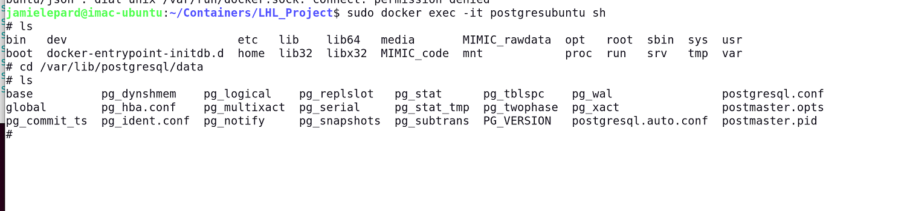

* [X] Obtain Data from MIMIC
* [X] EXtract all csv files
* [ ] Imported in postrgres
* [X] Use the sql to index each table. [Link to file](MIMIC_info\mimic-iv\buildmimic\postgres\index.sql)
* [X] Recreate the PK and FK constraint for each table. [Link to file](MIMIC_info\mimic-iv\buildmimic\postgres\constraint.sql)
* [ ] Review Readdme again [Link](MIMIC_info\mimic-iv\concepts_postgres\README.md)
  * [X] Create ' concent fucntions' tables using sql [Link to file](MIMIC_info\mimic-iv\concepts_postgres\postgres-functions.sql)
  * [X] Crecate 'concepts' tables [Link](MIMIC_info\mimic-iv\concepts_postgres\postgres-make-concepts.sql)

Concepts (query) Tables available/imported

-- dependencies

* [X] demographics/icustay_times.sql #COMPLETE
* [X] demographics/icustay_hourly.sql #COMPLETE
* [X] demographics/weight_durations.sql #COMPLETE
* [ ] measurement/urine_output.sql
* [ ] organfailure/kdigo_uo.sql

-- demographics

* [X] demographics/age.sql
* [X] demographics/icustay_detail_OLD.sql

-- measurement

* [X] measurement/bg.sql
* [X] measurement/blood_differential.sql #COMPLETED
* [ ] measurement/cardiac_marker.sql
* [X] measurement/chemistry.sql
* [ ] measurement/coagulation.sql
* [X] measurement/complete_blood_count.sql
* [ ] measurement/creatinine_baseline.sql
* [ ] measurement/enzyme.sql
* [X] measurement/gcs.sql
* [ ] measurement/height.sql
* [ ] measurement/icp.sql
* [X] measurement/inflammation.sql
* [X] measurement/oxygen_delivery.sql #COMPLETED -low data volume
* [ ] measurement/rhythm.sql
* [ ] measurement/urine_output_rate.sql
* [X] measurement/ventilator_setting.sql
* [X] measurement/vitalsign.sql #COMPLETED 384 records

-- comorbidity

* [ ] comorbidity/charlson.sql

-- medication

* [ ] medication/antibiotic.sql
* [ ] medication/dobutamine.sql
* [ ] medication/dopamine.sql
* [ ] medication/epinephrine.sql
* [ ] medication/milrinone.sql
* [ ] medication/neuroblock.sql
* [ ] medication/norepinephrine.sql
* [ ] medication/phenylephrine.sql
* [ ] medication/vasopressin.sql

-- treatment

* [ ] treatment/crrt.sql
* [ ] treatment/invasive_line.sql
* [ ] treatment/rrt.sql
* [ ] treatment/ventilation.sql

-- firstday

* [ ] firstday/first_day_bg.sql
* [ ] firstday/first_day_bg_art.sql
* [ ] firstday/first_day_gcs.sql
* [ ] firstday/first_day_height.sql
* [ ] firstday/first_day_lab.sql
* [ ] firstday/first_day_rrt.sql
* [ ] firstday/first_day_urine_output.sql
* [ ] firstday/first_day_vitalsign.sql
* [ ] firstday/first_day_weight.sql

-- organfailure

* [ ] organfailure/kdigo_creatinine.sql
* [ ] organfailure/meld.sql

-- score

* [ ] score/apsiii.sql
* [ ] score/lods.sql
* [ ] score/oasis.sql
* [ ] score/sapsii.sql
* [ ] score/sirs.sql
* [ ] score/sofa.sql

-- sepsis

* [ ] sepsis/suspicion_of_infection.sql

-- final tables which were dependent on one or more prior tables

* [ ] organfailure/kdigo_stages.sql
* [ ] firstday/first_day_sofa.sql
* [ ] sepsis/sepsis3.sql
* [ ] medication/vasoactive_agent.sql
* [ ] medication/norepinephrine_equivalent_dose.sql

* [ ] **Delete** the Old Postgres database on Ubunut here.... 
