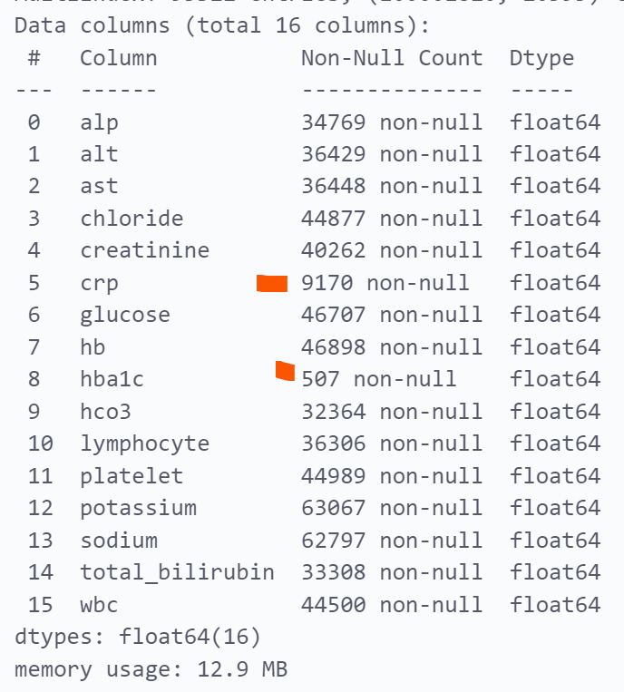

# Overview

Prolonged Hospital Length of Stay (PLOS) is an indicator of deteriorated efficiency in Quality of Care `1`. In addition, it has considerable implications on surgical unit operation. PLOS is a high driver for surgery cancellations. One goal of public health management is to reduce PLOS by identifying its most relevant predictors and initiating mitigations early in the care pathway. The objective of this project is to explore Machine Learning (ML) models that best predict PLOS and then deploy the model. The successful proof of concept will see a hospital operation leader upload (anonymous) information and receive a risk profile and predicted LOS for the patients on the ward.  

# Dataset

The INSPIRE dataset is a publicly available research dataset in perioperative medicine, which includes approximately 130,000 cases who underwent anesthesia for surgery at an academic institution in South Korea between 2011 and 2020. This dataset includes patient characteristics such as age, sex, physical status classification, diagnosis, surgical procedure code, department, and type of anesthesia. It also includes vital signs in the operating theatre, general wards, and intensive care units (ICUs), laboratory results from six months before admission to six months after discharge, and medication during hospitalization. `2`

# Methods
 * [ ] Database preparation
 * [ ] EDA
 * [ ] Pre-processing
 * [ ] Models
   * [ ] baseline LR 
   * [ ] XGBoost
   * [ ] neural network
 * [ ] Deployment
   * [ ] Azure..
  
# Database preparation

The primary data set contains three main tables of interest (operation, vitals, and lab) Record counts can be seen in the below schema. Associated tables were joined to include descrptions for the the main tables to include human-readable labels. By way of example, the prodecure (surgery) names in Operations table were provided as the ICD-10 Procedure Coding Standard. 

The dataframe used for exploratory data analysis was comprised from a series of subqueries and joins between the three database tables. The following rationale and considerations were employed:

1. All surgeries must appear in the final data table. Op_id is the primary key and there are 128,000 records. This was a quality check used through out the dataframe development.  
2. Subject_ID is not unique. There is a 1-many relationship between subject and operation (a subject may have >1 surgey on the same admission)  
3. Vitals timing: vitals are taken at the time of discharge from Operating Room in ~50% of operations. If there was no exact match between vital chart_time and OR_out, then the minimum of absolute value of vitals either before or after OR_out were used.   
4. Vitals scope: the data set has over 30 vitals. However, given many of these vitals are limited in scope to the operation itself (ie. gas mix and flow rate). Furthermore, additional features have performance implications on the database. As a result, the vitals scope was reduced to approximately 15.  
5. Labs timing: timing of lab tests followed a similar approach to the vitals. It should be noted that lab results are collected with reduced frequency than vitals. A 'backstop' should be considered in the event that 'nearest' lab results are several days after the procedure. 
6. Labs scope: In the interests of maintaining performance, the lab test scope was contrained to ~15 tests. These tests are the most common and and therefore will lead to the lowest chance of null values.   

Postgres Queries: 
 Queries used in the preparation of the data can be found in the [query](_src\query) folder.
 Files include: 
 * ADD_LABS.sql - creates the 'labs_in_hospital_filter' table containing list of lab results related to subjects. 
 * ADD_VITALS.sql - creates the 'vitals_in_hospital_filter' table which contains the vitals related to each operation_id. 
 * clean_ICD_tables - used to join ICD10 descriptions to operations table. 

  
# Exploratory Data Evaluation

## Understanding the Operation

### Objective
1. Confirm Scope of Model (which surgeries)
2. Confirm the definition of PLOS by surgery (when does it become 'prolonged')

Lines of inquiry: 
1. Which are most common surgeries (Category/specific) 
2. What is the distribution of surgery (OR) durations for each surgery category? 
3. What is the time distribution 

## Understanding the Features

>**Vitals** - Drop features with high nulls  

> **Labs** - Drop features with high nulls  
>   
> 
# Pre-processing
### Operations
* [x] create flag (0/1) if person went to ICU post op
* [x] flag if the subject is an outlier. 

### Features: 
* [x] set threshold for drop vs impute clinical features (ex. bp)
* [x] impute means for NaN (grouped by ASA, sex, and Age)

### Correlelation
* [ ] review correlations between procedures and LOS
* [ ] review correlation between labs and LOS
* [ ] heamaps

## Principle Component Analysis
Following categorical encoding (one-hot), there were >150 features within the dataset. The majority of the features were a result of encoding the surgery type and the clinicial (vitals/labs)features. 

A single PCA would not be appropriate to reduce the features. Elected to group features into 4 catergories and identify optimatl principle components then most influential features within. 

Feature categories: 
* Dempographic - height, weight, ASA
* Operation - logisitics of the operation iteself
* Procedure - the type of operations by PCD category (heart, ears, feet)
* Clinical - vital signs and laboratory results taken as proximal to the end of operation time stamp. 

### Initial PCA (N count): 
* demographic_columns, 'N': 2
* operation_columns, 'N': 6
* clinical_columns, 'N': 6
* procedure_columns, 'N': 6

### PCA Interpretation and Impact on Feature Selection

**Hyperparameters:**
| Feature Group | N |
|---------------|---|
|demographic_columns| 2|
| operation_columns |4|
| clinical_columns| 4|
| procedure_columns| 4|

Demographics: 

> 
  
Operations: 
>   

Procedure:   

>   

Clinicial: 

> 

Impact of PCA on Feature Selection: 

The most impactful 47 features of the original, encoded data set have been identified and the four-phased Principle Component Analysis. The original data set contained >140 features. These have now been reduced to 47. 

The features selected for future analysis and inclusion in the modelling are provide below with a description: 

> 

# Machine Learning Models

## Training 

## Evaluation

# Deployment

# Discussion

# Conclusion

