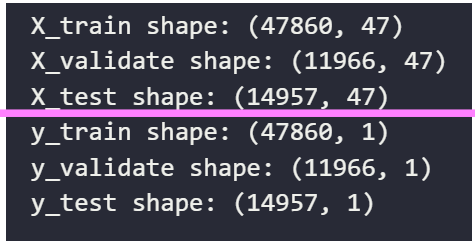
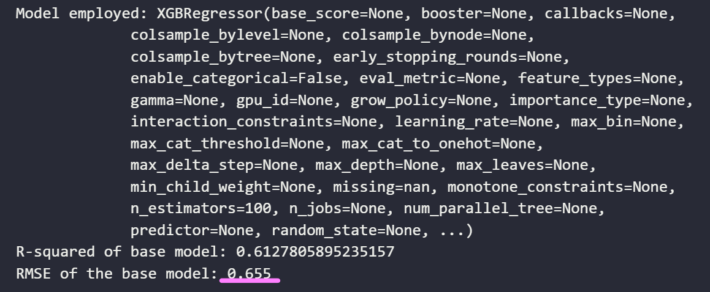

# Overview

Prolonged Hospital Length of Stay (PLOS) is an indicator of deteriorated efficiency in Quality of Care `1`. In addition, it has considerable implications on surgical unit operation. PLOS is a high driver for surgery cancellations. One goal of public health management is to reduce PLOS by identifying its most relevant predictors and initiating mitigations early in the care pathway. The objective of this project is to explore Machine Learning (ML) models that best predict PLOS and then deploy the model. The successful proof of concept will see a hospital operation leader upload (anonymous) information and receive a risk profile and predicted LOS for the patients on the ward.  

# Hypothesis

The post-oparative legnth of stay (LOS) and correspondingly, the risk of prolonged length of stay, can be accurately predicted at the time of admission to the recovery ward. Data points test the hypothesis include select patient demographic, surgey logistic information, and clinical information at the conclusion of the procedure.   

# Dataset

The INSPIRE dataset is a publicly available research dataset in perioperative medicine, which includes approximately 130,000 cases who underwent anesthesia for surgery at an academic institution in South Korea between 2011 and 2020. This dataset includes patient characteristics such as age, sex, physical status classification, diagnosis, surgical procedure code, department, and type of anesthesia. It also includes vital signs in the operating theatre, general wards, and intensive care units (ICUs), laboratory results from six months before admission to six months after discharge, and medication during hospitalization. `2`

# Methods
 * [ ] Database preparation
 * [ ] Exploratory Data Analysis (EDA)
 * [ ] Pre-processing
 * [ ] Models
   * [ ] Linear Regression
   * [ ] Random Forest
   * [ ] Extra Trees
   * [ ] XGBoost
   * [ ] CatBoost
 * [ ] Deployment
  
# Database preparation

The primary data set contains three main tables of interest (operation, vitals, and lab) Record counts can be seen in the below schema. Associated tables were joined to include descrptions for the the main tables to include human-readable labels. By way of example, the prodecure (surgery) names in Operations table were provided as the ICD-10 Procedure Coding Standard. 

The dataframe used for exploratory data analysis was comprised from a series of subqueries and joins between the three database tables. The following rationale and considerations were employed:

1. All surgeries must appear in the final data table. Op_id is the primary key and there are 128,000 records. This was a quality check used through out the dataframe development.  
2. Subject_ID is not unique. There is a 1-many relationship between subject and operation (a subject may have >1 surgey on the same admission)  
3. Vitals timing: vitals are taken at the time of discharge from Operating Room in ~50% of operations. If there was no exact match between vital chart_time and OR_out, then the minimum of absolute value of vitals either before or after OR_out were used.   
4. Vitals scope: the data set has over 30 vitals. However, given many of these vitals are limited in scope to the operation itself (ie. gas mix and flow rate). Furthermore, additional features have performance implications on the database. As a result, the vitals scope was reduced to approximately 15.  
5. Labs timing: timing of lab tests followed a similar approach to the vitals. It should be noted that lab results are collected with reduced frequency than vitals. A 'backstop' should be considered in the event that 'nearest' lab results are several days after the procedure. 
6. Labs scope: In the interests of maintaining performance, the lab test scope was contrained to ~15 tests. These tests are the most common and and therefore will lead to the lowest chance of null values.   

Postgres Queries:  
 Queries used in the preparation of the data can be found in the [query](_src\query) folder.
 Files include: 
 * ADD_LABS.sql - creates the 'labs_in_hospital_filter' table containing list of lab results related to subjects. 
 * ADD_VITALS.sql - creates the 'vitals_in_hospital_filter' table which contains the vitals related to each operation_id. 
 * clean_ICD_tables - used to join ICD10 descriptions to operations table. 

## Intermediate Data File Summary

> Notebook: [0.Data_import](_src\0.Data_import.ipynb)

The following csv files are generated through the data import, scoping, and feature engineering steps prior to Modelling. These maybe found in the [_data](_data) folder

|Step |File Name|Description|
|-----|--------------|--------------|
|1a.  |operations_pcd|	Raw Operations Table. Not joined to Labs or Vitals. |
|1b.  |vitals_in_hospital_filter|	Raw Vitals Table - filtered for those vitals that are clsoest to the OR END time|
|1c.  |labs_in_hospital_filter|	Raw LAbs Table - filtered for those vitals that are clsoest to the OR END time|
|2. |operations_fulldata|	Operations Table JOINED to Labs and Vitals (contains duplicates due to absence of unique key|
|3.| operations_fulldata_nodup|	Operations Table JOINED to Labs and Vitals (duplicates removed on 'op_id', 'subject_id', 'hadm_id'. Retain first occurrence|
| || |
|4a.|category_VOL|	Top X surgery categories by Volume as specificed in variable. |
|4b. |category_STD|	Top X surgery categories by Standard Deviation in LOS|
||||	
|5. |operations_inscope_CATEGORIES|	Finalized list - PRIOR to pre-proccessing and feature selection. |
|6.| **operatons_imputed_CLEAN** | File has engineered features: LOS, Prolonged LOS (y/n),OR duration, Anesthesia duration, ICU visit (y/n)|
|7.| operations_1hot_encoded | Encoded categorical features for use within PCA (feature reduction)|

 
 

  
# Exploratory Data Analysis
 

## Understanding the 'Surgical suite Operation'

> Notebook: [01.EDA_1_Volume](_src\01.EDA_1_Volume.ipynb)  
> Notebook: [02.EDA_2_LOS](_src\02.EDA_2_LOS.ipynb)

The objective of the first component of the project is to review the data and gain an understanding of the patient and provider flow. Given the complexity and number of clinical and non-clinical features in the dataset, a visualization dashboard was created to support analysis. The Power BI dashboard can also be used post-deployment as a potential interface for data ingestion and/or a performance dashboard. 

**Lines of inquiry:**

1. What are most common surgeries (category/specific)?
2. What is the distribution of surgery (OR) durations for each surgery category? 
3. What is the time distribution for patient populations, surgery type, etc?
4. Does a visit to the ICU seem to have any correlation to a prolonged LOS? 
5. Is there a correlation between LOS and patient age, length of time under anesthesia, or surgical duration?  
 

**Power BI Dashboard:**

## Understanding the Features

One of the first tasks in reviewing features is to identify features with a significant portion of null values. There are predominantly two alternatives when nulls are found: 

1) Drop the feature if the null count is 'significant'
2) Impute the missing values if the null count is 'acceptable'

The Vitals table and Lab info table contained serveal features with a large number of nulls. These are identified below and subsequently dropped from data frame. 

|Vitals Table | Lab Result Table|
|-------|----------|
|
|
|
 
 
 

# Pre-processing and Feature Engineering

> Notebook: [04.EDA_4_outliers_impute](_src\04.EDA_4_outliers_impute.ipynb)

The original data set contained de-identified timestamps at various points in their care journey. In accordance with best practice, these times were normalized against the patient's admission time to the hospital.Several features were calculated using these time stamps. 

### Operations

Time stamps were used to calculate (engineer):
* Length of Stay (discharge time - OR end time)
* Operation duration (or_end - or_start)
* Anesthesia duration (an_end - an_start)
* Flag (0/1) if subject went to ICU post op (icu_in != 0)
* Flag (0/1) if the LOS for a subject was an outlier.

### Impute Features

In working dataset, there instances (features) where there some null values that required 'filling' (imputing). Fortunately, most of these null values were clinical results (lab results or vitals), not operational measures or Length of Stay.

An effort was taken the group the subjects first by age, sex and ASA, then immpute the necessary values (average / mode). By way of example, the average white blood cell count (wbc) for 50 year old, Males, of ASA 2 wasq used to impute the missing value for sujects meeting the same grouping. This process was repeated for all other missing values.   

### Correlelation

Linear regression was initiall pusued for the modelling. Accordingly, correlation coefficients and a heatmap was created to visualize the relationship. The heatmap is presented in the PowerBI dashboard and below. 

  

## Principle Component Analysis

>Notebook: [05.PCA](_src\05.PCA.ipynb)

`NOTE: PCA was performed in the intial project iteration, but later excluded from final models`  

Following categorical encoding (one-hot), there were >160 features within the dataset. The majority of the features were a result of encoding the surgery type and the clinicial (vitals/labs)features. 

A single PCA would not be appropriate to reduce the features. Elected to group features into 4 catergories and identify optimatl principle components then most influential features within. 

Feature categories: 
* Demographic - height, weight, ASA
* Operation - logisitics of the operation iteself
* Procedure - the type of operations by PCD category (heart, ears, feet)
* Clinical - vital signs and laboratory results taken as proximal to the end of operation time stamp. 

### Initial PCA (N count): 
* demographic_columns, 'N': 2
* operation_columns, 'N': 6
* clinical_columns, 'N': 6
* procedure_columns, 'N': 6

### PCA Interpretation and Impact on Feature Selection

**Hyperparameters:**
| Feature Group | N |
|---------------|---|
|demographic_columns| 2|
| operation_columns |4|
| clinical_columns| 4|
| procedure_columns| 4|

Demographics: 

> 
  

  
Operations: 
> 
 

Procedure:   
>
  

Clinicial: 
>
 

### Impact of PCA on Feature Selection:   

The most impactful 47 features of the original, encoded data set have been identified and the four-phased Principle Component Analysis. The original data set contained 170 features. These have now been reduced to 47. 

The features selected for future analysis and inclusion in the modelling are provide below with a description: 

>
 
  

 
 
 

# Machine Learning Models

## Training 

### Data Split
* Training Set: Used to train your models.  
* Validation Set: Used to fine-tune hyperparameters, select models, and monitor training progress. 
* Testing Set: Used to evaluate the final model's performance on unseen data and estimate its generalization performance.

>

## Evaluation

### Baseline Models (no hyperparameter tuning)  

> Linear Regression  
> 

> Random Forest  
> 

> Extra Trees
> 

> XGBoost
> 

> CatBoost  
> CatBoost is designed specifically with a focus on categorical feature handling. It uses a specialized method for encoding categorical variables called "Ordered Target Encoding." CatBoost automatically detects and encodes categorical features without manual intervention (ie 1-hot encoding). It also includes techniques like "Ordered Boosting" and "Bayesian Regularization" to improve performance and reduce overfitting.
> 
> 

### Hyperparameter Tuning

Catboost ensemble model showed the most promise and was selected for optimization and hyperparameter tuning. A Grid Search method (as opposed to Random Search) was used to tune the algorithm. 

For following grid paramaters were evaluated: 
> 

**Result of Grid Search yielded:**

> 

# Deployment

# Discussion

# Conclusion

# Future Considerations

* [ ] Introduce deep learning models (additional compute required)
* [ ] Create an 'intermediate' categorization - currently either LOS (very specific) and Prolonged (binary). Create bins to represent 'degree' of PLOS
* [ ] Broaden data set - currently constrained to INSPIRE. Include other data sets such as MIMIC, PMSI,HiRID,AUMC

### Models

LightGBM:

LightGBM provides support for categorical features and handles them efficiently. It uses techniques like "Histogram-based Learning" and "Gradient-based One-Side Sampling (GOSS)" to process categorical features without the need for one-hot encoding. This means that you can use LightGBM directly with datasets that contain categorical variables, and it will handle them seamlessly. LightGBM also allows you to specify which columns are categorical, making it suitable for mixed data types.

CatBoost:

CatBoost is designed specifically with a focus on categorical feature handling. It uses a specialized method for encoding categorical variables called "Ordered Target Encoding." CatBoost automatically detects and encodes categorical features without manual intervention. It also includes techniques like "Ordered Boosting" and "Bayesian Regularization" to improve performance and reduce overfitting.
